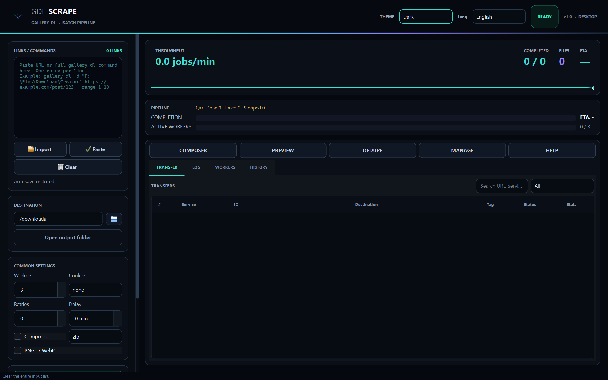

<p align="center">
  
</p>

<h1 align="center">GdlScrape</h1>

<p align="center"><strong>Gallery downloads, composed.</strong></p>

<p align="center">
  
  <a href="https://github.com/Halo1211/GdlScrape/actions/workflows/ci.yml"></a>
  
  
  
</p>

GdlScrape is a desktop download manager for [`gallery-dl`](https://github.com/mikf/gallery-dl). It turns gallery collection work into a visual workflow with a composer, parallel queue, download history, scheduling, secure account profiles, and post-processing tools.

> [!IMPORTANT]
> GdlScrape is an independent community interface and is not affiliated with the gallery-dl project. Download only content you are permitted to access and retain.



## Highlights

- Compose jobs from URLs or complete `gallery-dl` commands without duplicating settings.
- Run a bounded parallel queue with pause, stop, cancel, retry, and live worker status.
- Preview the final command and run a safe simulation before downloading.
- Import TXT, CSV, or XLSX databases with tags, notes, destinations, and per-job arguments.
- Keep a searchable SQLite library, persistent history, interrupted-run recovery, and schedules.
- Use browser cookies, `cookies.txt`, OAuth, or secure OS-backed account profiles.
- Build site presets, filters, archive settings, and post-processing rules visually.
- Switch between dark and light themes and English or Indonesian UI text.
- Install or update an isolated `gallery-dl` runtime from the management center.
- Protect exported logs, reports, sessions, and previews with credential redaction.

## Requirements

- Python 3.10 or newer
- Windows, Linux, or macOS
- [`gallery-dl`](https://gdl-org.github.io/docs/) 1.29 or newer

Optional tools extend specific workflows:

- FFmpeg for Pixiv Ugoira and media conversion
- 7-Zip for `.7z` output
- `yt-dlp` for extractors that delegate video downloads

## Quick start

```powershell
git clone https://github.com/Halo1211/GdlScrape.git
cd GdlScrape
py -m pip install -r requirements.txt
py gdlscrape.py
```

You can also launch the package directly:

```powershell
py -m gallery_dl_app
```

## Basic workflow

1. Open **Composer** and add one or more supported URLs.
2. Configure authentication under **Login & Cookies** only when the site requires it.
3. Apply one-time job overrides or save reusable defaults to the active config.
4. Select **Prepare safe test** and review the command preview.
5. Add the jobs to the queue and press `Ctrl+Enter` to start.

GdlScrape runs gallery-dl as a subprocess. It does not replace gallery-dl's extractor, configuration, or archive behavior.

## Input formats

Use one entry per line:

```text
https://example.com/user/123
https://example.com/user/456 --range 1-20
gallery-dl -d "D:/Media/Creator" https://example.com/user/789
python -m gallery_dl --cookies-from-browser firefox https://example.com/post/42
```

CSV and XLSX imports support `url`, `destination`, `extra_args`, `enabled`, `tag`, `notes`, or a raw `command` column.

## Privacy and security

- Secrets are never intended to be committed to this repository.
- Account profile secrets use the system keyring or Windows DPAPI.
- Temporary merged config files are permission-restricted and removed after a run.
- Sensitive command arguments, headers, URLs, and subprocess output are redacted before persistence or export.
- Clipboard monitoring is opt-in, host allowlisted, and never starts a download automatically.

Plain gallery-dl config files and their backups can still contain credentials. Review them before sharing diagnostics or backups.

## Keyboard shortcuts

| Shortcut | Action |
| --- | --- |
| `Ctrl+O` | Import a database |
| `Ctrl+S` | Save the current session |
| `Ctrl+Enter` | Start downloads |
| `Ctrl+Shift+P` | Preview final commands |
| `Ctrl+L` | Focus the input editor |
| `F5` | Run the health check |

## Development

Create an isolated environment, install the project with development tools, and run the checks:

```powershell
py -m venv .venv
.\.venv\Scripts\Activate.ps1
py -m pip install -e ".[dev]"
py -m unittest discover -s tests -v
ruff check .
```

Build a Windows executable with:

```powershell
.\scripts\build_windows.ps1
```

The script produces a single Windows executable at `release/GdlScrape.exe`. The release directory is intentionally ignored by Git. See [ARCHITECTURE.md](ARCHITECTURE.md) for component boundaries and [CONTRIBUTING.md](CONTRIBUTING.md) before submitting changes.

## Data location

Application data is stored outside the repository under `~/.gallery_dl_gui_dashboard`. The legacy directory name is intentionally retained in v1.0 so existing libraries, settings, schedules, profiles, and backups are not lost during the GdlScrape rebrand.

## Release status

This repository represents **GdlScrape v1.0**. See [CHANGELOG.md](CHANGELOG.md) for release notes.

## License

No open-source license has been selected yet. Unless a license is added, the source remains **all rights reserved**. Choose a license before inviting third-party redistribution or contributions.
