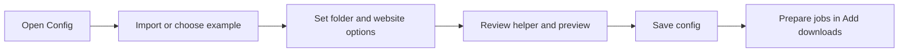

# Configuration guide

Use **Config** to edit reusable gallery-dl defaults. Use **Add downloads** for
links and options that apply only to the jobs you are preparing. Saving a config
does not start a download.

## Start with an example or existing file

1. Open **Config → Start here**.
2. Import a JSON `.json` or `.conf` file, or select a starter example.
3. Choose your download folder and configure any required login.
4. Edit the relevant website settings.
5. Review the config helper and preview.
6. Select **Save config file** or **Save As...**.

Loading an example replaces the current draft. Importing reads the source file;
**Save As...** lets you keep that source unchanged. Updating an existing config
creates a timestamped backup.

The [example reference](CONFIG_EXAMPLES_REVIEW.md) explains all 15 presets and
links to their upstream sources.

## Shared defaults and website settings

Choose shared settings when a rule should apply to every website. Choose a
specific website to override its defaults. Settings for different websites remain
in the draft when you switch between them.

Removing a local option restores inheritance. An explicit empty or disabled value
can have a different meaning. The editor shows the source of inherited values;
use its reset control when you want to inherit again.

Imported values, unknown options, and named processing definitions are preserved
until you edit them. Use the searchable **All settings** reference for options
without a dedicated form. The bundled reference covers gallery-dl 1.32.14;
runtime discovery adds options exposed by the installed downloader.

## Folder and filename rules

Set the download root first. Enter one subfolder level per row in the folder
editor. Filename patterns use gallery-dl metadata fields, such as IDs and file
extensions; available fields depend on the website and page type.

For conditional rules:

1. Add the condition and its output pattern.
2. Order specific conditions before broader ones.
3. Add a blank-condition fallback for unmatched items.
4. Review the example result before saving.

Imported conditions are retained as data while editing. The helper does not
evaluate them. Inspect available metadata with gallery-dl's keyword-listing mode
before using a field from another site's example.

In **Add downloads**, blank filename and subfolder overrides retain these saved
rules. **Exact folder (-D)** bypasses subfolders for those jobs.

## File filters and download history

Choose a media filter for images, video, audio, or a custom extension list. The
custom extension editor accepts extensions such as `jpg, png, webp`. GIF counts
as an image; extension filters do not inspect file contents.

Disabling a filter explicitly permits all files at that level. Resetting it
restores inherited filtering. Imported advanced expressions remain intact until
you replace them.

Download history uses a gallery-dl archive database to skip known items. Choose a
stable database location if several page types should share history. Changing the
archive ID format does not rewrite existing records; use the Pixiv shared-history
example before creating a new collection.

## Actions after downloading

The **After downloading** editor configures gallery-dl processing actions.
Supported workflows include:

- JSON metadata and post-text files.
- Tag text files and timestamp updates.
- ZIP/CBZ archives, including extra files such as `info.json`.
- Pixiv Ugoira animation conversion or original-frame archives.

Choose the metadata root and enter subfolder levels separately to keep information
files beside media or in another folder. JSON indentation supports spaces or tabs.
For archives, enter one extra file per row and choose whether to keep originals.

Shared and site actions accumulate. A site list does not replace shared actions,
so review the effective action list to avoid running a task twice. Named actions
can share definitions; editing a site's copy preserves the shared definition.

Pixiv animation output has two workflows:

| Format | Result | Additional tool |
| --- | --- | --- |
| ZIP | Original frames and `animation.json` | None |
| MP4, WebM, GIF | Encoded animation | FFmpeg |

Pixiv still requires your own login. Original-file retention is a separate choice.

## Use the config helper

Review messages about missing tools, conflicting paths, processing actions,
filters, history, and inherited defaults. Resolve errors before saving or running
jobs. The helper inspects configuration structure without downloading content or
executing configured actions.

URL validation also checks patterns locally. Neither check proves that the target
exists or that authentication will succeed. Use a simulation for a website-level
check; it contacts the site and follows gallery-dl's normal configuration behavior.

## Login and private data

Use **Manage → Accounts / Login** to create an account profile, then select it for
the relevant jobs. Follow the site's in-app guidance for browser cookies,
`cookies.txt`, passwords, API tokens, or OAuth.

Avoid putting reusable credentials in examples. Configs and their backups can
contain plain-text secrets, even when account profiles use an OS credential vault.
Review files and screenshots before sharing them.

## Troubleshooting

| Problem | Check |
| --- | --- |
| Import fails | The file must contain a JSON object with valid types. Duplicate setting keys and non-finite numbers are rejected; repeated `#` comments are allowed. |
| A setting appears unchanged | Check whether the current value comes from shared defaults or a different website/page type. |
| A processing action runs twice | Check both shared and site action lists. |
| Folder or filename preview lacks a value | Confirm that the website supplies the chosen metadata field. |
| Animation conversion fails | Check FFmpeg availability and Pixiv login. ZIP frame archives do not require FFmpeg. |
| Jobs use an unexpected folder | Check the job destination and whether Exact folder is enabled. |
| Downloads are skipped | Check the archive database and its ID format. |

For additional options, see the
[gallery-dl configuration manual](https://gdl-org.github.io/docs/configuration.html).
Return to the [project README](../README.md) for installation and queue usage.
